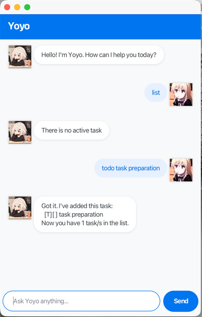

# Yoyo - your personalised ChatBot

> Yoyo is excited to meet you!

Yoyo is a task management chatbot.

## 📖 Table of Contents
*   [Quick Start](#quick-start)
*   [Features](#features)
    *   [Adding Tasks](#adding-tasks)
    *   [Managing Tasks](#managing-tasks)
    *   [Finding Things](#finding-things)
*   [Command Summary](#command-summary)

## ⚡ Quick Start

1.  Ensure you have Java `17` or above installed.
2.  Download the latest `yoyo.jar` from the [latest release](https://github.com/gaoze24/ip/releases/tag/A-Release/yoyo.jar).
3.  Double-click the file to open the app.
4.  Type commands in the box and press Enter.

## ⚔️ Features

### Adding Tasks

#### 1. Todo (`todo`)
Adds a simple task to your list.
*   **Format:** `todo <description>`
*   **Example:** `todo Prepare for the exam`

---

#### 2. Deadline (`deadline`)
Adds a task that must be done by a specific time.
*   **Format:** `deadline <description> /by <yyyy-MM-dd>`
*   **Example:** `deadline Submit physics assignment /by 2026-01-10`

---

#### 3. Event (`event`)
Adds a task that occurs within a time frame.
*   **Format:** `event <description> /from <yyyy-MM-dd> /to <yyyy-MM-dd>`
*   **Example:** `event CS2103T Final /from 2025-06-01 /to 2025-06-01`

---

### Managing Tasks

#### 4. List (`list`)
Displays all the recorded tasks in the app.
*   **Format:** `list`

---

#### 5. Mark as Done (`mark`)
Marks a task as completed.
*   **Format:** `mark <index>`
*   **Example:** `mark 1`

---

#### 6. Mark as Not Done (`unmark`)
Marks a task as incomplete.
*   **Format:** `unmark <index>`
*   **Example:** `unmark 1`

---

#### 7. Delete (`delete`)
Permanently removes a task.
*   **Format:** `delete <index>`
*   **Example:** `delete 3`

---

### Finding Things

#### 8. Find (`find`)
Searches for tasks containing a keyword.
*   **Format:** `find <keyword>`
*   **Example:** `find Test`

---

---
#### 9. Check date (`check`)
Check tasks that happen on a specific date.
*   **Format:** `check <date>`
*   **Example:** `check 2025-06-01`

---

#### 10. Exit (`bye`)
Ends your watch.
*   **Format:** `bye`

---

## 📜 Command Summary

| Action           | Format                                 |
|:-----------------|:---------------------------------------|
| **Add Todo**     | `todo <desc>`                          |
| **Add Deadline** | `deadline <desc> /by <date>`           |
| **Add Event**    | `event <desc> /from <date> /to <date>` |
| **List**         | `list`                                 |
| **Mark/Unmark**  | `mark <index>` / `unmark <index>`      |
| **Delete**       | `delete <index>`                       |
| **Find**         | `find <keyword>`                       |
| **Check Date**   | `check <date>`                         |
| **Exit**         | `bye`                                  |

